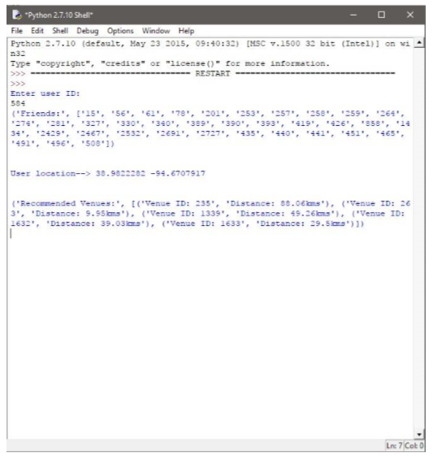

# Hotel Recommendation System using Web Scrapping in Python

A recommendation system is a subclass of information filtering system that seeks to predict the preference a user would give to a product. Such systems are increasingly popular in recent years, and utilized in variety of areas of market. For the recommendation system to work various criteria like previous browsing history of user, purchases, cost preferences, etc. are considered.  For the development of our project-Hotel Recommendation system, we have used data from two sites- Foursquare and Yelp.   Foursquare is a local search and discovery system which provides personalized recommendation of place.   Yelp is crowd-sourced local business site where users submit a review of services/products using one to five-star rating system.  For the working of recommendation system, data is extracted from Yelp and Foursquare during run time using web crawlers.  Also, we have the datasets of the user-venue based details of Foursquare, which we have acquired from archive.org.

## Modules

### 1. Module 1 - Recommendation with GUI 

* Data – Data is extracted from two sites: Foursquare and Yelp. Data from Yelp and Foursquare is collected in run- time. 
* Web scrapping- It is used for extracting data from front-end of a website. It is form of copying html source-code of page from which data is extracted from web. For scraping, BeautifulSoup library is used. 
* Recommendation- The user receives recommendation from two web-sites. Recommendation considers location and price criteria. 
* GUI- System is developed using Python and for the development of interface Tkinter library is used.

#### Output

### 2. Module 2 - Graphs and Geo-plotting 

* Data – Data related to user-venue of foursquare is acquired from archive.org website. Data sets include: Sociograph, Ratings, Check-In data, and location based information of users and venues. 
* Recommendation- In this module, the recommendation is done on the basis of where the friends of a user like to go. 
* Graphs- Graphs are plotted based on the datasets provided. Ex- User-User friend graph, User-Venue Rating graph,etc. 
* GeoPlotting- Since the data sets are provided with the location of users and venues, thus their locations are plotted on map using Basemap library, and markers are shown on google maps. 

 #### Output

##### Geo-plot

##### Socio-graph (User-User)

##### Weighted-rating graph (User-Venue)

### Future Works

Feel free to fork this repo, Explore it and add more features to this project. Do not forget to star it if you liked it! :wink: